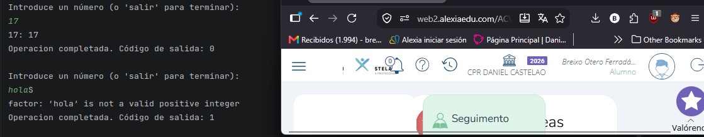
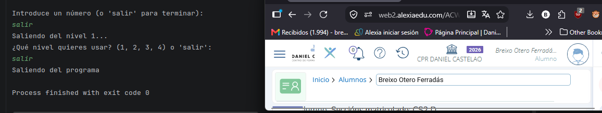
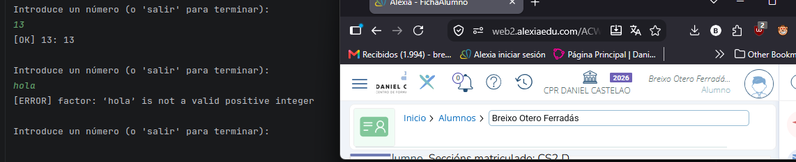
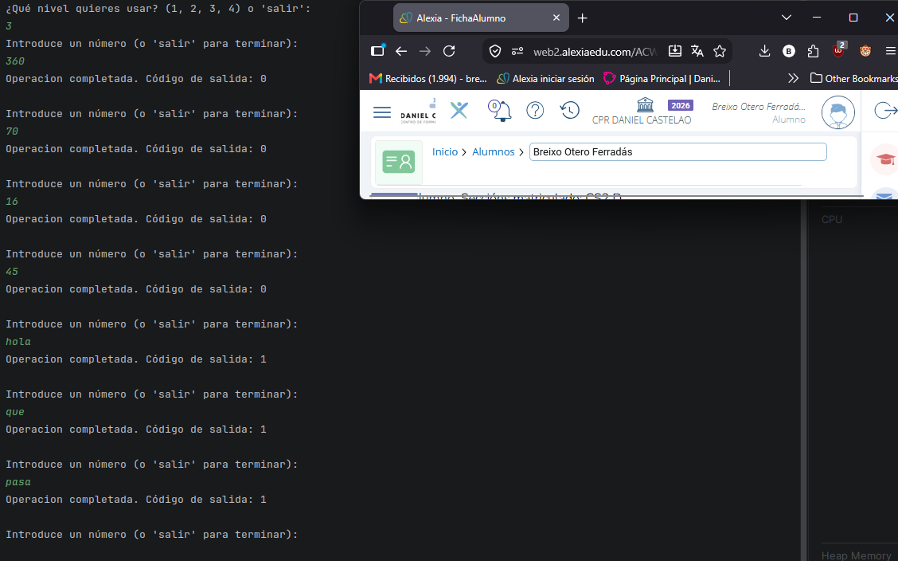
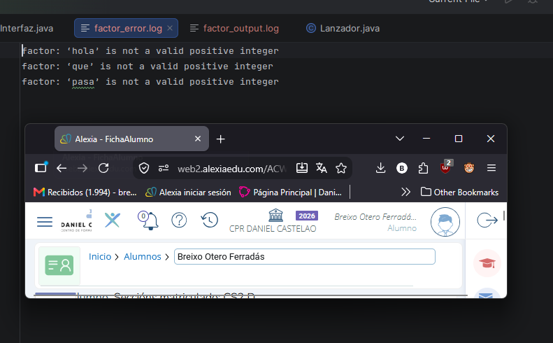
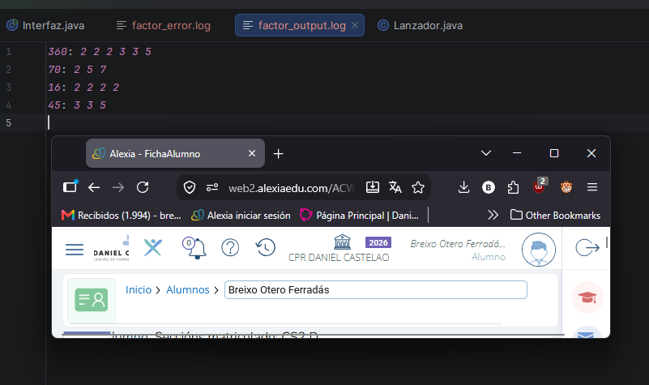
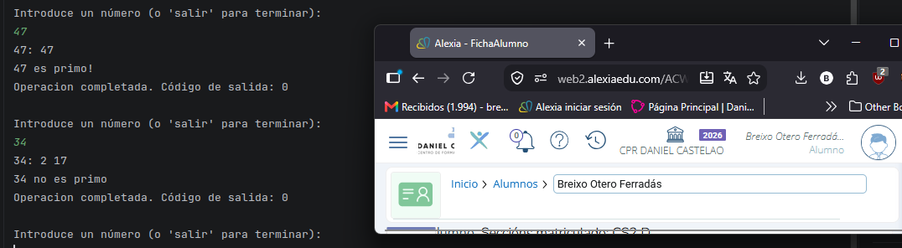

<h1>Tarea 05: Process Builder y ´factor´</h1>

<h2>Niveles Realizados: 1, 2, 3 y 4</h2>
<h3>NIVEL 1:</h3>
<h4>Tabla de comprobaciones:</h4>

| Valor  | Salida de Factor | Codigo de Salida |
| ------------- | ------------- | ------------- |
| 360 | 2 2 2 3 3 5 | 0 |
| 1 | Nada | Second Header | 0 |
| 1 | 17 | Content Cell | 0 |
| 1 | factor: 'hola' is not a valid positive integer | 1 |
| 1 | factor: invalid option -- '5' | Content Cell | 1 |

<h4>Error que tuve programando:</h4>

Al programar el Nivel 4 con los numeros primos, me di cuenta de que la consola indicaba 
los resultados invertidos, ya que al probar con un numero como el 7, el programa decia
que "no es primo", mientras que al probar con un número compuesto como el 12, decia que
"era primo". La causa de esto era un fallo de lógica mio, en el que comprobaba que la lista 
que guardaba con los numeros factorizados del numero dado fuera mayor a 1 `if (factores.size() > 1)`,
en vez de que comprobara que fuera igual a 1 `if (factores.size() == 1)`

<h4>Capturas: </h4>

<h3>NIVEL 2:</h3>
<h4>Capturas: </h4>

<h3>NIVEL 3:</h3>
<h4>Capturas: </h4>

<h3>NIVEL 4:</h3>
<h4>Capturas: </h4>

